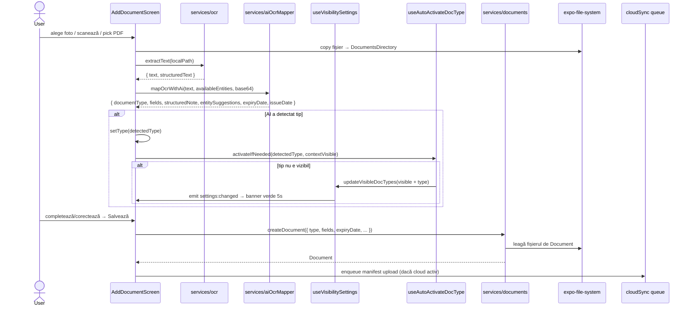
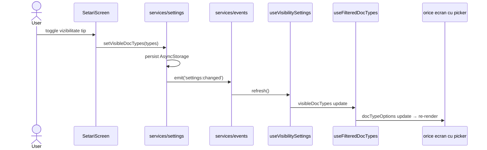
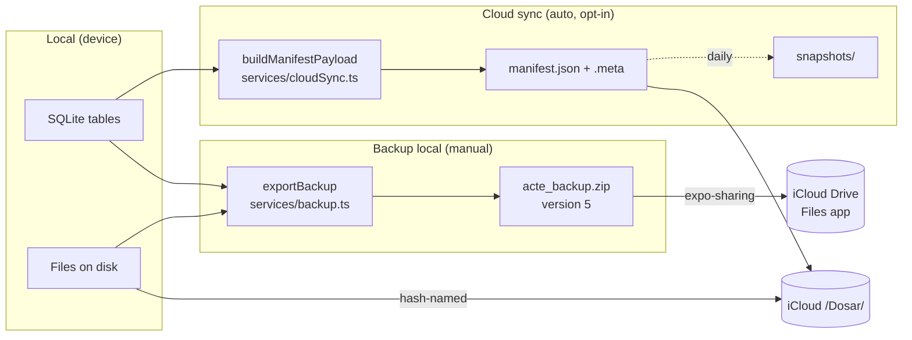
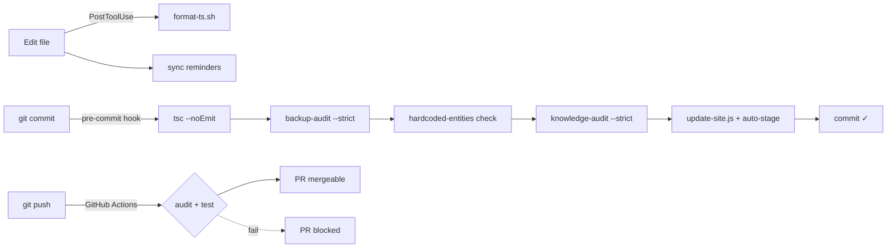

# Arhitectură Dosar

> **Scop:** o singură pagină care răspunde „cum curg datele și unde am voie să modific". Citită înainte de orice feature care atinge ≥3 fișiere.

## Stack și principii

| Aspect | Decizie |
|---|---|
| Platformă | React Native + Expo (TypeScript) |
| Stocare locală | SQLite (`expo-sqlite`) — **singura sursă de date la runtime** |
| Fișiere | `expo-file-system` (DocumentsDirectory) |
| Backup local | ZIP version 5 prin `expo-sharing` |
| Backup cloud | iCloud Drive (`react-native-cloud-storage`) — opțional |
| Auth | **Niciun backend.** App lock local (PIN/biometric prin `expo-local-authentication`) |
| AI extern | Mistral / OpenAI (opt-in explicit prin consimțământ) |
| AI local | În așteptare (vezi memorie `project_gemma4_dosar.md`) |
| Limbă UI | Română (toate textele) |
| Design | EVPoint + primary `#9EB567`, dark mode obligatoriu |

## Folder map

```
app/
├── app/(tabs)/             ← Expo Router screens (Home, Entități, Documente, Expirări, Setări, Chat)
├── components/             ← reusable (UI primitives + feature-specific)
│   ├── ui/                 ← FormPageScreen, FormSheetModal, BottomActionBar, etc.
│   ├── document/           ← (P2.x — în curs de spargere)
│   └── settings/           ← (P2.3 — în curs de spargere)
├── hooks/                  ← state machines (useDocuments, useEntities, useVisibilitySettings...)
├── services/               ← business logic
│   ├── db.ts               ← migrare SQLite (sursa schemei)
│   ├── documents.ts        ← CRUD documente
│   ├── entities.ts         ← CRUD entități
│   ├── backup.ts           ← export/import ZIP
│   ├── cloudSync.ts        ← upload manifest în iCloud (P2.9 — split planificat)
│   ├── appKnowledge.ts     ← sursa pentru chatbot
│   ├── aiOcrMapper.ts      ← AI extract fields + classify
│   ├── ocrExtractors.ts    ← (P2.7 — split planificat)
│   └── ...
├── types/
│   └── index.ts            ← **sursa unică** pentru EntityType, DocumentType, etichete, mappings
├── theme/
│   └── colors.ts           ← paleta light + dark (single source pentru culori)
├── constants/
│   └── Colors.ts           ← delegă la `theme/colors.ts`
├── scripts/                ← audit scripts (backup-audit, knowledge-audit, check-hardcoded-entities, update-site)
├── docs/                   ← HTML site + DESIGN_SYSTEM.md + ARCHITECTURE.md
└── __tests__/              ← Jest (unit, smoke, services)
```

## Sursa unică de adevăr per concept

| Concept | Fișier | Folosit prin |
|---|---|---|
| Listă entități | `types/index.ts` `ALL_ENTITY_TYPES` | `useEntities()` |
| Etichete entități | `types/index.ts` `ENTITY_TYPE_LABELS` | direct lookup |
| Emoji entitate | `types/index.ts` `ENTITY_TYPE_EMOJI` | direct lookup |
| Listă tipuri document | `types/index.ts` `STANDARD_DOC_TYPES` | `useFilteredDocTypes()` |
| Etichete tipuri | `types/index.ts` `DOCUMENT_TYPE_LABELS` | direct lookup |
| Tipuri per entitate | `types/index.ts` `ENTITY_DOCUMENT_TYPES` | `useFilteredDocTypes({ entityTypes })` |
| Tipuri vizibile (per user) | `services/settings.ts` | `useVisibilitySettings()` |
| Knowledge chatbot | `services/appKnowledge.ts` | `services/chatbot.ts` |
| Schema DB | `services/db.ts` | propagat în `backup.ts` + `cloudSync.ts` |
| Paletă culori | `theme/colors.ts` | `useColorScheme()` din `@/components/useColorScheme` |

**Regulă:** nimic nu duplică conținut din coloana 2. Linterul (P1.3) + audit scripts blochează drift.

## Data flow: upload document



## Data flow: settings change → reactive UI



## Data flow: backup ZIP + cloud manifest



## Reguli critice (sumar — full în `.claude/rules/`)

| Regulă | Fișier rule | Enforcement |
|---|---|---|
| Schema SQLite atinge `db.ts` + `backup.ts` + `cloudSync.ts` | `.claude/rules/backup.md` | `scripts/backup-audit.js --strict` (CI) |
| `private_notes` NU pleacă la AI | `.claude/rules/ai-privacy.md` | review + `sanitizeDocumentForAI` helper |
| Liste tipuri/entități NU duplicate | `.claude/rules/dynamic-types.md` | `scripts/check-hardcoded-entities.js` + `local-rules/no-direct-doc-type-iteration` |
| Niciun hex hardcodat în componente | `.claude/rules/design.md` | `local-rules/no-hardcoded-hex-colors` |
| `useColorScheme` doar din `@/components/useColorScheme` | `.claude/rules/design.md` | review |
| Formulare: `FormPageScreen` sau `FormSheetModal` | `app/.claude/CLAUDE.md` Pattern-uri | agent `form-consistency-guard` |
| Chei API NU în `EXPO_PUBLIC_*` | `.claude/lessons/2026-03-15-no-expo-public-secrets.md` | review |
| Fișiere > 400 linii → split | `docs/superpowers/plans/2026-05-14-ai-dev-optimizations.md` Phase 2 | manual review (lint rule de adăugat) |

## Pipeline calitate



## Add a new document type (checklist scurt)

1. `types/index.ts`: union `DocumentType` + `STANDARD_DOC_TYPES` + `DOCUMENT_TYPE_LABELS` + `ENTITY_DOCUMENT_TYPES[<entitate>]` + `DOC_PRIMARY_ENTITY`.
2. `services/aiTypeRegistry.ts`: `DOC_TYPE_AI_REGISTRY[<tip>]` cu aliases + description.
3. `app/(tabs)/documente/index.tsx` + `expirari.tsx`: `DOC_ICON`, `DOC_ICON_BG`, `DOC_ICON_COLOR`.
4. `node scripts/update-site.js` regenerează docs.

**Restul (picker, vizibilitate, chatbot, site) ridică automat.** Dacă atingi alte fișiere — e bug în arhitectură, nu refactor.

## Add a new entity (checklist scurt)

1. `types/index.ts`: `EntityType` union + `ALL_ENTITY_TYPES` + `ENTITY_TYPE_LABELS` + `ENTITY_TYPE_EMOJI` + `ENTITY_DOCUMENT_TYPES[<entitate>]`.
2. `services/db.ts`: tabel + indexuri.
3. `services/entities.ts` sau `services/<entity>.ts`: CRUD.
4. `hooks/useEntities.ts`: state + `Promise.all` în refresh + case în `resolveEntityName`.
5. `services/backup.ts`: collect + restore + wipe.
6. `services/cloudSync.ts`: manifest payload.
7. `scripts/backup-audit.js`: `TABLE_TO_MANIFEST_FIELD` dacă numele tabel diferă.

**Toate celelalte (Setări → Vizibilitate, Adaugă entitate, picker, „Legat de", chip-uri Onboarding, emoji-uri) ridică automat din `types/index.ts`.**

## Ce să verifici după orice modificare în servicii core

| Modificare | Verificare automată | Verificare manuală |
|---|---|---|
| Schema SQLite | `node scripts/backup-audit.js --strict` | restore dintr-un backup vechi |
| `appKnowledge.ts` | `node scripts/knowledge-audit.js --strict` | chat: întreabă-l de feature-ul nou |
| `types/index.ts` (DOC_TYPE_LABELS) | `node scripts/update-site.js` (auto-stage docs) | picker tipuri în add/edit |
| Paletă culori | `local-rules/no-hardcoded-hex-colors` (warn) | dark mode toggle |
| Manifest cloud | `npm test -- cloudCrypto manifestHash` | upload + restore pe device cu iCloud |

## Vezi și

- `app/.claude/CLAUDE.md` (sau `/Users/ax/work/documents/.claude/CLAUDE.md`) — instrucțiuni Claude/Cursor
- `.claude/rules/` — reguli per scope
- `.claude/lessons/INDEX.md` — lecții din incidente trecute
- `docs/DESIGN_SYSTEM.md` — design tokens detaliate
- `docs/superpowers/plans/` — planuri implementare features mari
