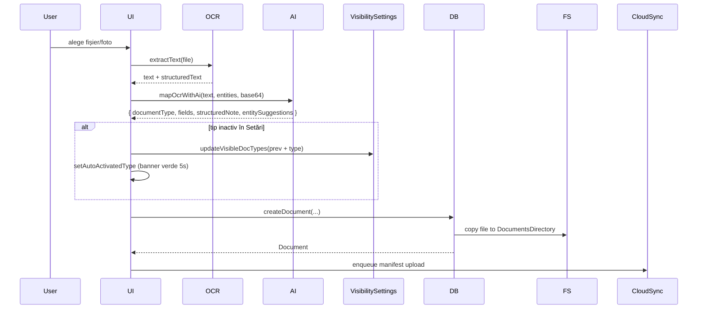
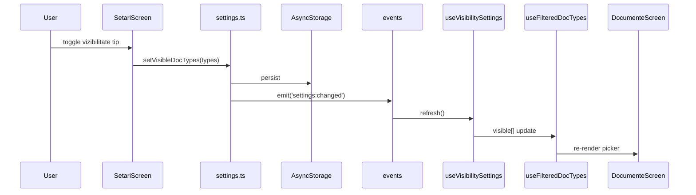
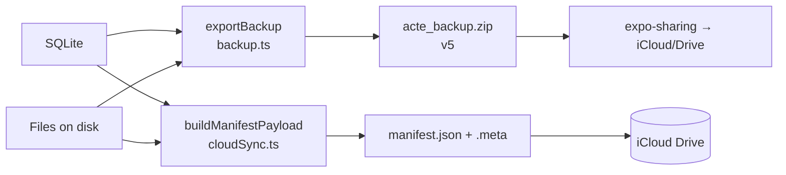

# AI Development Optimizations — Implementation Plan

> **For agentic workers:** REQUIRED SUB-SKILL: Use superpowers:subagent-driven-development (recommended) or superpowers:executing-plans to implement this plan task-by-task. Steps use checkbox (`- [ ]`) syntax for tracking.

**Goal:** Eliminate regression risk in AI-assisted development on Dosar by closing all drift loops, splitting god-files, raising test coverage, and enforcing rules at multiple layers (lint + audit + CI + tests).

**Architecture:** Three-layer defense per concern. Each rule is enforced in (a) writing in CLAUDE.md/rules, (b) lint rule or audit script that fails locally, (c) CI gate that fails on PR. Plus splitting any file >400 lines into hooks + sub-components so AI works with focused context.

**Tech Stack:** GitHub Actions for CI, ESLint custom rules (CommonJS plugin), Jest+React Native Testing Library for tests, Node scripts for audits, conventional-commits + standard-version for releases, git worktree for isolation.

---

## Phase Overview

| Phase | Item | Files affected | Risk |
|---|---|---|---|
| **P1.1** | CI gate (GitHub Actions) | `.github/workflows/` | Low |
| **P1.2** | Test for AutoActivatedBanner (regresie fix-ul de azi) | `__tests__/smoke/` | Low |
| **P1.3** | ESLint custom rules: hex colors + doc-type iteration | `eslint-rules/`, `.eslintrc.js` | Low |
| **P1.4** | Lessons.md indexat în folder | `.claude/lessons/` | Low |
| **P1.5** | ARCHITECTURE.md cu data flow | `docs/` | Low |
| **P1.6** | Memorie persistentă completată cu anti-patterns Dosar | `~/.claude/.../memory/` | Low |
| **P1.7** | Consolidare CLAUDE.md (root vs app) | `.claude/CLAUDE.md` | Low |
| **P2.1** | Split add.tsx (1906 → ~300 + 5 module) | `app/(tabs)/documente/`, `hooks/`, `components/document/` | Mediu |
| **P2.2** | Split edit.tsx (1498) | same | Mediu |
| **P2.3** | Split setari.tsx (2571) | `components/settings/` | Mare |
| **P2.4** | Split [id].tsx documente (1477) | `components/document/` | Mediu |
| **P2.5** | Split OnboardingWizard.tsx (1439) | `components/onboarding/` | Mediu |
| **P2.6** | Split chat.tsx (1392) | `components/chat/` | Mediu |
| **P2.7** | Split ocrExtractors.ts (1127) | `services/ocr/` | Mediu |
| **P2.8** | Split entitati/[id].tsx (1112) | `components/entity/` | Mediu |
| **P2.9** | Split cloudSync.ts (1069) | `services/cloud/` | Mediu |
| **P3.1** | Cleanup `check-hardcoded-entities` violări existente | various | Mediu |
| **P3.2** | Switch pre-commit hook → `--strict` | `scripts/hooks/pre-commit` | Low |
| **P3.3** | Worktrees procedurized în CLAUDE.md | `.claude/CLAUDE.md` | Low |
| **P3.4** | Conventional commits + standard-version + CHANGELOG.md | `package.json`, `CHANGELOG.md` | Low |

**Total**: 20 phases. Phases 1.x sunt foundation (1 sesiune). 2.x sunt splitting (multi-sesiune, dar fiecare task închis în sine). 3.x sunt cleanup & polish.

---

## P1.1 — CI gate (GitHub Actions)

**Files:**
- Create: `.github/workflows/audit.yml`
- Create: `.github/workflows/test.yml`

- [ ] **Step 1: Create audit workflow**

```yaml
# .github/workflows/audit.yml
name: Audit
on:
  push:
    branches: [main, 'feat/**', 'fix/**']
  pull_request:
    branches: [main]
jobs:
  audit:
    runs-on: ubuntu-latest
    defaults:
      run:
        working-directory: app
    steps:
      - uses: actions/checkout@v4
      - uses: actions/setup-node@v4
        with:
          node-version: '20'
          cache: 'npm'
          cache-dependency-path: app/package-lock.json
      - run: npm ci
      - run: npm run type-check
      - run: node scripts/backup-audit.js --strict
      - run: node scripts/check-hardcoded-entities.js
      - run: node scripts/knowledge-audit.js --strict
      - name: Verify docs are up to date
        run: |
          node scripts/update-site.js
          git diff --exit-code docs/ README.md || (echo "Docs out of sync — run update-site.js" && exit 1)
```

- [ ] **Step 2: Create test workflow**

```yaml
# .github/workflows/test.yml
name: Test
on:
  push:
    branches: [main, 'feat/**', 'fix/**']
  pull_request:
    branches: [main]
jobs:
  test:
    runs-on: ubuntu-latest
    defaults:
      run:
        working-directory: app
    steps:
      - uses: actions/checkout@v4
      - uses: actions/setup-node@v4
        with:
          node-version: '20'
          cache: 'npm'
          cache-dependency-path: app/package-lock.json
      - run: npm ci
      - run: npm test -- --coverage
```

- [ ] **Step 3: Commit**

```bash
git add .github/
git commit -m "ci: add audit and test workflows on push/PR"
```

- [ ] **Step 4: Push and verify on GitHub**

```bash
git push
```

Verifică pe GitHub că workflow-ul rulează verde la următorul push.

---

## P1.2 — Test pentru AutoActivatedBanner (regresie fix-ul de azi)

**Files:**
- Create: `__tests__/smoke/AutoActivatedBanner.test.tsx`

- [ ] **Step 1: Write the failing test**

```tsx
// __tests__/smoke/AutoActivatedBanner.test.tsx
import { render, waitFor, act } from '@testing-library/react-native';
import { jest } from '@jest/globals';

const mockUpdateVisibleDocTypes = jest.fn(() => Promise.resolve());
const mockSetType = jest.fn();

jest.mock('@/hooks/useVisibilitySettings', () => ({
  useVisibilitySettings: () => ({
    visibleEntityTypes: [],
    visibleDocTypes: ['altul', 'buletin'],
    updateVisibleDocTypes: mockUpdateVisibleDocTypes,
  }),
}));

// (mock-uri suplimentare pentru hooks-urile add.tsx — se completează la rulare)

describe('AutoActivatedBanner', () => {
  beforeEach(() => {
    mockUpdateVisibleDocTypes.mockClear();
    mockSetType.mockClear();
  });

  it('auto-activează tipul când AI detectează un tip inactiv', async () => {
    // ARRANGE: AI detect "talon" care nu e în visibleDocTypes
    // ACT: simulează call la mapOcrWithAi cu result.documentType = 'talon'
    // ASSERT: updateVisibleDocTypes apelat cu ['altul', 'buletin', 'talon']
    expect(true).toBe(false); // placeholder — finalizat în Step 3
  });

  it('banner-ul dispare după 5 secunde', async () => {
    jest.useFakeTimers();
    // ARRANGE+ACT: trigger auto-activare
    // ASSERT: banner vizibil
    // ACT: jest.advanceTimersByTime(5000)
    // ASSERT: banner dispărut
    expect(true).toBe(false); // placeholder
    jest.useRealTimers();
  });
});
```

- [ ] **Step 2: Run test to verify it fails**

```bash
npm test -- AutoActivatedBanner
```
Expected: 2 failed tests.

- [ ] **Step 3: Refactor add.tsx — extrage logica într-un hook testabil**

Hook nou `hooks/useAutoActivateDocType.ts`:
```typescript
// hooks/useAutoActivateDocType.ts
import { useEffect, useState } from 'react';
import type { DocumentType } from '@/types';
import { useVisibilitySettings } from './useVisibilitySettings';

const AUTO_DISMISS_MS = 5000;

export function useAutoActivateDocType() {
  const { visibleDocTypes, updateVisibleDocTypes } = useVisibilitySettings();
  const [autoActivatedType, setAutoActivatedType] = useState<DocumentType | null>(null);

  useEffect(() => {
    if (!autoActivatedType) return;
    const id = setTimeout(() => setAutoActivatedType(null), AUTO_DISMISS_MS);
    return () => clearTimeout(id);
  }, [autoActivatedType]);

  async function activateIfNeeded(type: DocumentType, contextVisible: DocumentType[]): Promise<void> {
    if (contextVisible.includes(type)) {
      setAutoActivatedType(null);
      return;
    }
    try {
      if (!visibleDocTypes.includes(type)) {
        await updateVisibleDocTypes([...visibleDocTypes, type]);
      }
      setAutoActivatedType(type);
    } catch {
      /* păstrăm tipul setat local */
    }
  }

  return {
    autoActivatedType,
    setAutoActivatedType,
    activateIfNeeded,
  };
}
```

Înlocuiește în `add.tsx` codul inline cu apel la hook.

- [ ] **Step 4: Rewrite test against the hook**

```tsx
// __tests__/unit/useAutoActivateDocType.test.ts
import { renderHook, act, waitFor } from '@testing-library/react-native';
import { useAutoActivateDocType } from '@/hooks/useAutoActivateDocType';

const mockUpdate = jest.fn(() => Promise.resolve());
jest.mock('@/hooks/useVisibilitySettings', () => ({
  useVisibilitySettings: () => ({
    visibleDocTypes: ['altul', 'buletin'],
    updateVisibleDocTypes: mockUpdate,
  }),
}));

describe('useAutoActivateDocType', () => {
  beforeEach(() => mockUpdate.mockClear());

  it('activează tip inactiv și expune autoActivatedType', async () => {
    const { result } = renderHook(() => useAutoActivateDocType());
    await act(async () => {
      await result.current.activateIfNeeded('talon', ['altul', 'buletin']);
    });
    expect(mockUpdate).toHaveBeenCalledWith(['altul', 'buletin', 'talon']);
    expect(result.current.autoActivatedType).toBe('talon');
  });

  it('NU activează dacă tipul e deja vizibil', async () => {
    const { result } = renderHook(() => useAutoActivateDocType());
    await act(async () => {
      await result.current.activateIfNeeded('buletin', ['altul', 'buletin']);
    });
    expect(mockUpdate).not.toHaveBeenCalled();
    expect(result.current.autoActivatedType).toBeNull();
  });

  it('auto-dismiss după 5s', async () => {
    jest.useFakeTimers();
    const { result } = renderHook(() => useAutoActivateDocType());
    await act(async () => {
      await result.current.activateIfNeeded('talon', ['altul']);
    });
    expect(result.current.autoActivatedType).toBe('talon');
    act(() => jest.advanceTimersByTime(5000));
    expect(result.current.autoActivatedType).toBeNull();
    jest.useRealTimers();
  });
});
```

- [ ] **Step 5: Run tests and confirm pass**

```bash
npm test -- useAutoActivateDocType
```
Expected: 3 passing.

- [ ] **Step 6: Commit**

```bash
git add hooks/useAutoActivateDocType.ts __tests__/unit/useAutoActivateDocType.test.ts app/\(tabs\)/documente/add.tsx
git commit -m "refactor: extract useAutoActivateDocType hook with tests"
```

---

## P1.3 — ESLint custom rules: hex colors + doc-type iteration

**Files:**
- Create: `eslint-rules/no-hardcoded-hex-colors.js`
- Create: `eslint-rules/no-direct-doc-type-iteration.js`
- Create: `eslint-rules/index.js`
- Modify: `.eslintrc.js`
- Create: `eslint-rules/__tests__/no-hardcoded-hex-colors.test.js`
- Create: `eslint-rules/__tests__/no-direct-doc-type-iteration.test.js`

- [ ] **Step 1: Write test for no-hardcoded-hex-colors**

```javascript
// eslint-rules/__tests__/no-hardcoded-hex-colors.test.js
const { RuleTester } = require('eslint');
const rule = require('../no-hardcoded-hex-colors');

const tester = new RuleTester({
  parserOptions: { ecmaVersion: 2022, sourceType: 'module', ecmaFeatures: { jsx: true } },
});

tester.run('no-hardcoded-hex-colors', rule, {
  valid: [
    "const c = 'transparent';",
    "const c = statusColors.ok;",
    "const c = palette.text;",
    "const c = `${palette.border}80`;",
  ],
  invalid: [
    { code: "const c = '#FFF';", errors: [{ message: /hex color/ }] },
    { code: "const c = '#FF9800';", errors: [{ message: /hex color/ }] },
    { code: "const c = 'rgba(232,165,58,0.18)';", errors: [{ message: /hex color/ }] },
  ],
});
```

- [ ] **Step 2: Run test to verify it fails**

```bash
node --test eslint-rules/__tests__/no-hardcoded-hex-colors.test.js
```
Expected: FAIL (module not found).

- [ ] **Step 3: Implement rule**

```javascript
// eslint-rules/no-hardcoded-hex-colors.js
const HEX = /^#([0-9A-Fa-f]{3,4}|[0-9A-Fa-f]{6}|[0-9A-Fa-f]{8})$/;
const RGBA = /^rgba?\(\s*\d+\s*,/i;

module.exports = {
  meta: {
    type: 'problem',
    docs: { description: 'Disallow hardcoded hex/rgba colors in components; use palette' },
    schema: [],
    messages: { hex: 'Hex/rgba color "{{value}}" hardcoded — use palette from @/theme/colors (paramaterized via useColorScheme).' },
  },
  create(context) {
    const filename = context.getFilename();
    // Permise în theme/colors.ts (sursa paletei)
    if (/theme\/colors\./.test(filename)) return {};
    return {
      Literal(node) {
        if (typeof node.value !== 'string') return;
        if (HEX.test(node.value) || RGBA.test(node.value)) {
          context.report({ node, messageId: 'hex', data: { value: node.value } });
        }
      },
    };
  },
};
```

- [ ] **Step 4: Run test, confirm pass**

```bash
node --test eslint-rules/__tests__/no-hardcoded-hex-colors.test.js
```
Expected: PASS.

- [ ] **Step 5: Write test for no-direct-doc-type-iteration**

```javascript
// eslint-rules/__tests__/no-direct-doc-type-iteration.test.js
const { RuleTester } = require('eslint');
const rule = require('../no-direct-doc-type-iteration');

const tester = new RuleTester({
  parserOptions: { ecmaVersion: 2022, sourceType: 'module', ecmaFeatures: { jsx: true } },
});

tester.run('no-direct-doc-type-iteration', rule, {
  valid: [
    "DOCUMENT_TYPE_LABELS[doc.type]",
    "const { docTypeOptions } = useFilteredDocTypes();",
  ],
  invalid: [
    { code: "Object.entries(DOCUMENT_TYPE_LABELS).map(([k,v]) => k);", errors: 1 },
    { code: "Object.keys(DOCUMENT_TYPE_LABELS).forEach(t => t);", errors: 1 },
    { code: "STANDARD_DOC_TYPES.map(t => t)", errors: 1 },
  ],
});
```

- [ ] **Step 6: Implement rule**

```javascript
// eslint-rules/no-direct-doc-type-iteration.js
module.exports = {
  meta: {
    type: 'problem',
    docs: { description: 'Forbid direct iteration over DOCUMENT_TYPE_LABELS / STANDARD_DOC_TYPES in UI — use useFilteredDocTypes()' },
    schema: [],
    messages: { iter: 'Direct iteration over {{name}} — use useFilteredDocTypes() instead (see .claude/rules/dynamic-types.md).' },
  },
  create(context) {
    const filename = context.getFilename();
    // Permis în types/index.ts (sursa) și în hooks/useFilteredDocTypes.ts
    if (/types\/index\.|hooks\/useFilteredDocTypes\./.test(filename)) return {};
    if (/scripts\//.test(filename)) return {}; // audit scripts pot itera
    if (/__tests__\//.test(filename)) return {};

    function checkArg(node, name) {
      context.report({ node, messageId: 'iter', data: { name } });
    }

    return {
      // Object.entries(X), Object.keys(X), Object.values(X) unde X e DOCUMENT_TYPE_LABELS
      CallExpression(node) {
        const isObjectIter =
          node.callee.type === 'MemberExpression' &&
          node.callee.object.name === 'Object' &&
          ['entries', 'keys', 'values'].includes(node.callee.property.name);
        if (isObjectIter && node.arguments[0]?.name === 'DOCUMENT_TYPE_LABELS') {
          checkArg(node, 'DOCUMENT_TYPE_LABELS');
        }
      },
      // X.map(...) / X.forEach(...) / X.filter(...) unde X e STANDARD_DOC_TYPES
      MemberExpression(node) {
        if (
          node.object.name === 'STANDARD_DOC_TYPES' &&
          ['map', 'forEach', 'filter', 'reduce'].includes(node.property.name)
        ) {
          checkArg(node, 'STANDARD_DOC_TYPES');
        }
      },
    };
  },
};
```

- [ ] **Step 7: Create index, wire to eslintrc**

```javascript
// eslint-rules/index.js
module.exports = {
  rules: {
    'no-hardcoded-hex-colors': require('./no-hardcoded-hex-colors'),
    'no-direct-doc-type-iteration': require('./no-direct-doc-type-iteration'),
  },
};
```

```javascript
// .eslintrc.js
module.exports = {
  extends: ['expo', 'prettier'],
  plugins: ['prettier', 'local'],
  rules: {
    'prettier/prettier': 'warn',
    '@typescript-eslint/no-explicit-any': 'warn',
    '@typescript-eslint/no-unused-vars': ['warn', { argsIgnorePattern: '^_' }],
    'no-console': ['warn', { allow: ['warn', 'error'] }],
    'local/no-hardcoded-hex-colors': 'warn',
    'local/no-direct-doc-type-iteration': 'error',
  },
  settings: {
    'import/resolver': { 'eslint-plugin-local': true },
  },
  overrides: [
    { files: ['theme/**'], rules: { 'local/no-hardcoded-hex-colors': 'off' } },
    { files: ['__tests__/**', 'scripts/**'], rules: { 'local/no-direct-doc-type-iteration': 'off' } },
  ],
  ignorePatterns: ['node_modules/', '.expo/', 'dist/', 'build/', 'eslint-rules/__tests__/'],
};
```

Install local plugin reference:
```bash
npm install --save-dev eslint-plugin-local
```
(or wire via `parserOptions` if eslint-plugin-local nu există — alternativ: `plugins: { local: require('./eslint-rules') }` în config.)

- [ ] **Step 8: Run both rule tests + lint**

```bash
node --test eslint-rules/__tests__/
npm run lint 2>&1 | tail -30
```

- [ ] **Step 9: Commit**

```bash
git add eslint-rules/ .eslintrc.js package.json package-lock.json
git commit -m "lint: add no-hardcoded-hex-colors and no-direct-doc-type-iteration custom rules"
```

---

## P1.4 — Lessons.md indexat în folder

**Files:**
- Create: `.claude/lessons/INDEX.md`
- Create: `.claude/lessons/2026-04-22-ios-linker.md`
- Create: `.claude/lessons/2026-05-12-auto-activate-types.md`
- Modify: `.claude/lessons.md` → redirect spre folder
- Modify: `.claude/CLAUDE.md` → updated path

- [ ] **Step 1: Read current lessons.md**

```bash
cat .claude/lessons.md
```

- [ ] **Step 2: Split each lesson into its own file with frontmatter**

```markdown
<!-- .claude/lessons/2026-04-22-ios-linker.md -->
---
date: 2026-04-22
tags: [ios, build, pods, xcode]
trigger: linker error after version bump or Xcode update
---

# iOS linker / pcm errors după version bump sau update Xcode

**Simptome:** ...
(conținut copiat din lessons.md secțiunea respectivă)
```

```markdown
<!-- .claude/lessons/2026-05-12-auto-activate-types.md -->
---
date: 2026-05-12
tags: [ux, document-types, ai-detection, settings]
trigger: AI detects inactive document type during upload
---

# Auto-activate AI-detected document types

**Problemă:** când AI detecta un tip inactiv în Setări, banner-ul „Deschide Setările" îl scotea pe utilizator din flow-ul de upload.

**Soluție:** la detecție inactivă, auto-activează tipul în setări + setează tipul + arată banner verde de confirmare (auto-dismiss 5s). Logica extrasă în `hooks/useAutoActivateDocType.ts` cu teste.

**Regulă derivată:** orice toast/banner care recomandă „du-te în Setări" e o oportunitate de auto-rezolvare cu confirmare ulterioară.
```

- [ ] **Step 3: Create INDEX.md**

```markdown
<!-- .claude/lessons/INDEX.md -->
# Lessons Index

Cronologic, descrescător. Front-matter `tags:` pe fiecare fișier.

| Data | Subiect | Tags |
|---|---|---|
| 2026-05-12 | [Auto-activate document types](2026-05-12-auto-activate-types.md) | ux, document-types, ai-detection |
| 2026-04-22 | [iOS linker errors](2026-04-22-ios-linker.md) | ios, build, pods, xcode |

## Cum cauți

```bash
# după tag
grep -l "tags:.*ios" .claude/lessons/*.md

# după trigger
grep -l "trigger:.*upload" .claude/lessons/*.md
```
```

- [ ] **Step 4: Replace lessons.md with redirect**

```markdown
<!-- .claude/lessons.md -->
# Lessons learned

Conținutul s-a mutat în `.claude/lessons/`. Vezi `.claude/lessons/INDEX.md`.

Convenție nouă: o lecție = un fișier cu front-matter. La adăugare:
1. Fișier nou `.claude/lessons/YYYY-MM-DD-<topic>.md` cu front-matter `date / tags / trigger`
2. Adaugă în `INDEX.md` (rând nou în tabel)
```

- [ ] **Step 5: Update CLAUDE.md reference**

```bash
sed -i.bak 's|`.claude/lessons.md`|`.claude/lessons/`|g' .claude/CLAUDE.md
rm .claude/CLAUDE.md.bak
```

- [ ] **Step 6: Commit**

```bash
git add .claude/lessons/ .claude/lessons.md .claude/CLAUDE.md
git commit -m "docs: split lessons.md into indexed folder with frontmatter tags"
```

---

## P1.5 — ARCHITECTURE.md cu data flow

**Files:**
- Create: `docs/ARCHITECTURE.md`

- [ ] **Step 1: Write ARCHITECTURE.md cu Mermaid diagrams**

```markdown
# Arhitectură Dosar

## Stack
- React Native + Expo (TypeScript)
- SQLite (`expo-sqlite`) — singura sursă de date
- expo-file-system — fișiere pe disc
- iCloud Drive — backup (sync + manual ZIP)
- Local-first; fără backend, fără auth online

## Data flow: upload document



## Data flow: settings change → reactive UI



## Data flow: backup ZIP + cloud manifest



## Sursa unică de adevăr per concept

| Concept | Fișier | Folosit prin |
|---|---|---|
| Lista entităților | `types/index.ts` `ALL_ENTITY_TYPES` | `useEntities()` |
| Etichete entități | `types/index.ts` `ENTITY_TYPE_LABELS` | direct map |
| Lista tipuri document | `types/index.ts` `STANDARD_DOC_TYPES` | `useFilteredDocTypes()` |
| Etichete tipuri | `types/index.ts` `DOCUMENT_TYPE_LABELS` | direct lookup |
| Tipuri vizibile | `services/settings.ts` | `useVisibilitySettings()` |
| Knowledge chatbot | `services/appKnowledge.ts` | `services/chatbot.ts` |
| Schema DB | `services/db.ts` | propagat în `backup.ts` + `cloudSync.ts` |

## Reguli critice (sumar)
1. Schimbarea schemei SQLite atinge **3 locuri**: `db.ts` + `backup.ts` (export+apply) + `cloudSync.ts` (manifest).
2. Câmpul `private_notes` nu pleacă NICIODATĂ la AI (vezi `.claude/rules/ai-privacy.md`).
3. Listele de tipuri/entități nu se duplică în UI (vezi `.claude/rules/dynamic-types.md`).
4. Niciun hex color hardcodat în componente (vezi `.claude/rules/design.md` + lint rule).
5. Formulare: `FormPageScreen` (Stack) sau `FormSheetModal` (modal) — niciun pattern nou.
```

- [ ] **Step 2: Verifică diagramele Mermaid randează (GitHub face render nativ)**

```bash
git add docs/ARCHITECTURE.md
git commit -m "docs: add ARCHITECTURE.md with data flow diagrams"
```

---

## P1.6 — Memorie persistentă completată cu anti-patterns Dosar

**Files:**
- Create: `~/.claude/projects/-Users-ax-work-documents/memory/dosar_anti_patterns.md`
- Create: `~/.claude/projects/-Users-ax-work-documents/memory/dosar_schema_propagation.md`
- Create: `~/.claude/projects/-Users-ax-work-documents/memory/dosar_god_files.md`
- Modify: `~/.claude/projects/-Users-ax-work-documents/memory/MEMORY.md`

- [ ] **Step 1: Add dosar_anti_patterns.md**

```markdown
---
name: Dosar UI anti-patterns
description: Hardcoded patterns to never reproduce when editing Dosar UI
type: feedback
---

NICIODATĂ în componente UI Dosar:
1. **`Object.entries(DOCUMENT_TYPE_LABELS).map(...)`** — folosește `useFilteredDocTypes()`. Motiv: ignoră vizibilitatea per user. Lint: `local/no-direct-doc-type-iteration`.
2. **Hex literali `'#FFF'`, `'rgba(...)'`** — folosește `palette` din `useColorScheme` + `@/theme/colors`. Motiv: rupe dark mode. Lint: `local/no-hardcoded-hex-colors`.
3. **`useColorScheme` din `'react-native'`** — folosește `'@/components/useColorScheme'`. Motiv: ignoră `ThemePreferenceContext` (preferința Auto/Deschis/Întunecat).
4. **`<Modal transparent>` cu input-uri** — folosește `FormSheetModal` sau `FormPageScreen`. Motiv: imposibil scroll cu tastatura.
5. **`d.person_id === id`** (acces direct la câmpuri legacy entity_id) — folosește `getDocumentsByEntityId('person', id)`. Motiv: ratează multi-link.

**How to apply:** check before editing any `app/(tabs)/**` sau `components/**`. Linterul prinde 1+2.
```

- [ ] **Step 2: Add dosar_schema_propagation.md**

```markdown
---
name: Dosar SQLite schema propagation
description: When adding a table/column, three locations must update in sync
type: reference
---

Orice modificare a schemei SQLite în Dosar atinge **TREI fișiere obligatoriu**:
1. `services/db.ts` — migrare (`ALTER TABLE` în try-catch dacă e coloană)
2. `services/backup.ts` — `exportBackup()` (collect) + `applyManifest()` (restore)
3. `services/cloudSync.ts` — `buildManifestPayload()` (upload manifest)

**Verificare:** `node scripts/backup-audit.js --strict` (rulează în pre-commit + CI).

**Why:** un singur loc lipsă = backup gol / sync rupt / restore corupt — fără eroare la compilare.
```

- [ ] **Step 3: Add dosar_god_files.md**

```markdown
---
name: Dosar god files — work plan
description: Files >400 lines that need splitting; track progress
type: project
---

Fișiere > 400 linii la 2026-05-14 (sursă: audit):
- [ ] `app/(tabs)/setari.tsx` (2571) — split în secțiuni
- [ ] `app/(tabs)/documente/add.tsx` (1906) — extrage hooks + sub-componente
- [ ] `app/(tabs)/documente/edit.tsx` (1498)
- [ ] `app/(tabs)/documente/[id].tsx` (1477)
- [ ] `components/OnboardingWizard.tsx` (1439)
- [ ] `app/(tabs)/chat.tsx` (1392)
- [ ] `services/ocrExtractors.ts` (1127)
- [ ] `app/(tabs)/entitati/[id].tsx` (1112)
- [ ] `services/cloudSync.ts` (1069)

**Why:** AI face mai bine pe fișiere <400 linii; reduce regresii când editezi într-un loc și strici în altul.

**How to apply:** la fiecare editare semnificativă într-un god-file, planifică un split incremental. Plan complet: `docs/superpowers/plans/2026-05-14-ai-dev-optimizations.md`.

Bifează pe măsură ce se face split.
```

- [ ] **Step 4: Update MEMORY.md index**

```markdown
- [iOS build recovery](ios_build_recovery.md) — full cleanup secvență pentru linker/pcm errors în Dosar (nu doar Clean Build Folder)
- [llama.cpp e NU](feedback_llama_cpp_no_go.md) — nu propune llama.cpp / llama.rn / GGUF pentru Dosar; userul a încercat și nu a mers
- [Gemma 4 on-device — în așteptare](project_gemma4_dosar.md) — plan integrare Gemma 4 E2B/E4B în Dosar; decizia 2026-04-29 a fost să aștepte suport oficial react-native-executorch
- [Surse on-device LLM iOS](reference_ondevice_llm_sources.md) — URL-uri de verificat când userul reia subiectul Gemma 4 / RN-Expo
- [Dosar anti-patterns](dosar_anti_patterns.md) — UI hardcoded patterns to never reproduce (linterul prinde 2 din 5)
- [Dosar schema propagation](dosar_schema_propagation.md) — orice ALTER SQLite atinge 3 fișiere
- [Dosar god files](dosar_god_files.md) — lista files >400 linii și progres split
```

- [ ] **Step 5: Commit (memory e personal, nu se comite în repo)**

Memoria e în `~/.claude/...`, nu în repo. Doar verifică că-i acolo:
```bash
ls ~/.claude/projects/-Users-ax-work-documents/memory/
```

---

## P1.7 — Consolidare CLAUDE.md

**Files:**
- Inspect: `/Users/ax/work/documents/.claude/CLAUDE.md` (root)
- Inspect: `/Users/ax/work/documents/app/.claude/CLAUDE.md` (app)
- Decide: păstrăm doar cel din `app/`

- [ ] **Step 1: Diff cele două**

```bash
diff /Users/ax/work/documents/.claude/CLAUDE.md /Users/ax/work/documents/app/.claude/CLAUDE.md
```

- [ ] **Step 2: Identifică conținut unic în root care nu există în app**

(manual review)

- [ ] **Step 3: Merge content unic în `app/.claude/CLAUDE.md`**

- [ ] **Step 4: Înlocuiește root cu pointer**

```markdown
<!-- /Users/ax/work/documents/.claude/CLAUDE.md -->
# Vezi `app/.claude/CLAUDE.md`

Sursa unică e în folderul `app/`. Acest fișier există doar ca redirect.
```

- [ ] **Step 5: Commit (root file e în alt repo / non-git — verifică)**

```bash
git status
git add app/.claude/CLAUDE.md
git commit -m "docs: consolidate CLAUDE.md sources, single source in app/"
```

---

## P2.1 — Split add.tsx (1906 linii)

**Files:**
- Create: `hooks/useDocumentForm.ts` — state management formular
- Create: `hooks/useAiAnalysis.ts` — flow AI (mapOcrWithAi, error handling)
- Create: `hooks/useOcrPipeline.ts` — OCR local + structured text
- Create: `hooks/useAutoActivateDocType.ts` — DEJA făcut în P1.2
- Create: `components/document/AiActionsRow.tsx`
- Create: `components/document/AutoActivatedBanner.tsx`
- Create: `components/document/DuplicateBanner.tsx`
- Create: `components/document/InactiveTypePicker.tsx` (cele „ascunse" din picker)
- Modify: `app/(tabs)/documente/add.tsx` (target: <400 linii, doar compoziție)

- [ ] **Step 1: Map current responsibilities in add.tsx**

```bash
# rulează manual — identifică secțiunile (zone de state, useEffect, handler-i, JSX, styles)
wc -l app/\(tabs\)/documente/add.tsx
grep -n "^  const \[" app/\(tabs\)/documente/add.tsx | head -30
grep -n "useEffect\|useCallback" app/\(tabs\)/documente/add.tsx
```

Produce o secțiune în plan cu mapping (state X → hook Y).

- [ ] **Step 2: Extrage `useAutoActivateDocType`** (deja făcut în P1.2, skip dacă deja există)

- [ ] **Step 3: Extrage `AutoActivatedBanner` component**

```tsx
// components/document/AutoActivatedBanner.tsx
import { View, Text, Pressable } from 'react-native';
import { Ionicons } from '@expo/vector-icons';
import { DOCUMENT_TYPE_LABELS } from '@/types';
import type { DocumentType } from '@/types';
import { useColorScheme } from '@/components/useColorScheme';
import { statusColors } from '@/theme/colors';
import Colors from '@/constants/Colors';

interface Props {
  type: DocumentType;
  onDismiss: () => void;
}

export function AutoActivatedBanner({ type, onDismiss }: Props) {
  const scheme = (useColorScheme() ?? 'light') as 'light' | 'dark';
  const C = Colors[scheme];
  return (
    <View
      style={{
        flexDirection: 'row',
        alignItems: 'flex-start',
        borderWidth: 1,
        borderRadius: 10,
        padding: 12,
        marginBottom: 16,
        backgroundColor: C.primaryMuted,
        borderColor: statusColors.ok,
      }}
    >
      <Ionicons name="checkmark-circle" size={18} color={statusColors.ok} style={{ marginRight: 8, marginTop: 1 }} />
      <View style={{ flex: 1 }}>
        <Text style={{ fontSize: 13, fontWeight: '700', marginBottom: 3, color: C.text }}>
          Tipul „{DOCUMENT_TYPE_LABELS[type] ?? type}" a fost activat automat
        </Text>
        <Text style={{ fontSize: 12, lineHeight: 17, color: C.textSecondary }}>
          Apare acum în Setări → Tipuri de documente vizibile.
        </Text>
      </View>
      <Pressable onPress={onDismiss} hitSlop={8}>
        <Ionicons name="close" size={16} color={C.textSecondary} />
      </Pressable>
    </View>
  );
}
```

- [ ] **Step 4: Write snapshot test for AutoActivatedBanner**

```tsx
// __tests__/smoke/AutoActivatedBanner.test.tsx
import { render } from '@testing-library/react-native';
import { AutoActivatedBanner } from '@/components/document/AutoActivatedBanner';

describe('AutoActivatedBanner', () => {
  it('randează label-ul tipului', () => {
    const { getByText } = render(<AutoActivatedBanner type="talon" onDismiss={() => {}} />);
    expect(getByText(/Talon/)).toBeTruthy();
  });

  it('apelează onDismiss la tap pe X', () => {
    const onDismiss = jest.fn();
    const { UNSAFE_getAllByType } = render(<AutoActivatedBanner type="talon" onDismiss={onDismiss} />);
    const pressables = UNSAFE_getAllByType(require('react-native').Pressable);
    pressables[pressables.length - 1].props.onPress();
    expect(onDismiss).toHaveBeenCalled();
  });
});
```

- [ ] **Step 5: Inline replace in add.tsx**

(specific edit — find old banner JSX, replace with `<AutoActivatedBanner type={autoActivatedType} onDismiss={...} />`)

- [ ] **Step 6: Extrage `DuplicateBanner`** (analog cu Step 3, pe secțiunea duplicat)

- [ ] **Step 7: Extrage `AiActionsRow`** (butoanele „Trimite la AI" + info)

- [ ] **Step 8: Extrage `hooks/useOcrPipeline.ts`**

Logică OCR local + structured text. Returns: `{ ocrText, structuredText, runOcr(file), ... }`.

- [ ] **Step 9: Extrage `hooks/useAiAnalysis.ts`**

Logică AI: `mapOcrWithAi` + entity suggestions + autofill expiry/issue dates.

- [ ] **Step 10: Extrage `hooks/useDocumentForm.ts`**

State: type, customTypeId, expiryDate, issueDate, note, privateNotes, autoDelete, entityLinks, metadata, etc.

- [ ] **Step 11: Verifică add.tsx final <400 linii**

```bash
wc -l app/\(tabs\)/documente/add.tsx
```
Expected: <400.

- [ ] **Step 12: Run full audit**

```bash
npm run audit && npm test -- documente
```

- [ ] **Step 13: Manual smoke test**

Pe device/simulator:
- Adaugă document nou → upload imagine → „Trimite la AI" → tip inactiv detectat → banner verde apare → tipul setat → dispare 5s

- [ ] **Step 14: Commit**

```bash
git add hooks/ components/document/ app/\(tabs\)/documente/add.tsx __tests__/
git commit -m "refactor(add): split 1906-line god file into hooks + sub-components (<400 main)"
```

---

## P2.2 — Split edit.tsx (1498 linii)

Edit-ul folosește deja multe din hooks-urile create în P2.1. Re-use, nu duplica.

**Files:**
- Reuse: `hooks/useDocumentForm.ts`, `hooks/useAiAnalysis.ts`, `hooks/useOcrPipeline.ts`
- Modify: `app/(tabs)/documente/edit.tsx` (target <400 linii)

- [ ] **Step 1: Identifică ce e duplicat cu add.tsx**

```bash
diff <(grep "^  const \[\|useEffect\|useCallback" app/\(tabs\)/documente/add.tsx) \
     <(grep "^  const \[\|useEffect\|useCallback" app/\(tabs\)/documente/edit.tsx)
```

- [ ] **Step 2: Generalizează `useDocumentForm`** — adaugă `initialDoc?: Document` parameter pentru edit mode.

- [ ] **Step 3: Înlocuiește în edit.tsx**

- [ ] **Step 4: Test add+edit nu sunt rupte**

- [ ] **Step 5: Commit**

```bash
git commit -m "refactor(edit): consolidate with add via shared hooks (<400 main)"
```

---

## P2.3 — Split setari.tsx (2571 linii — cel mai mare)

**Files:**
- Create: `components/settings/AppearanceSection.tsx`
- Create: `components/settings/VisibilitySection.tsx`
- Create: `components/settings/BackupSection.tsx`
- Create: `components/settings/CloudBackupSection.tsx`
- Create: `components/settings/AppLockSection.tsx`
- Create: `components/settings/NotificationsSection.tsx`
- Create: `components/settings/PrivacySection.tsx`
- Create: `components/settings/AboutSection.tsx`
- Modify: `app/(tabs)/setari.tsx` (~200 linii, doar layout + composition)

- [ ] **Step 1: Map secțiunile actuale**

```bash
grep -n "<.*Header\|<.*Title\|<.*Section" app/\(tabs\)/setari.tsx
```

- [ ] **Step 2-9:** Pentru fiecare secțiune, extrage într-o componentă separată cu props clare. (un task per secțiune)

- [ ] **Step 10: setari.tsx final = listă de `<XSection />`-uri**

- [ ] **Step 11: Run audit + test**

- [ ] **Step 12: Commit**

```bash
git commit -m "refactor(setari): split 2571-line god file into 8 section components"
```

---

## P2.4 — Split documente/[id].tsx (1477 linii)

**Files:**
- Create: `components/document/DocumentHeader.tsx`
- Create: `components/document/DocumentMetadataCard.tsx`
- Create: `components/document/DocumentPagesGallery.tsx`
- Create: `components/document/DocumentActions.tsx` (share, print, delete)
- Modify: `app/(tabs)/documente/[id].tsx` (<400 linii)

- [ ] **Step 1-5:** Similar cu P2.1. Verifică test.

- [ ] **Step 6: Commit**

```bash
git commit -m "refactor(document detail): split 1477-line file into sub-components"
```

---

## P2.5 — Split OnboardingWizard.tsx (1439 linii)

**Files:**
- Create: `components/onboarding/WelcomeStep.tsx`
- Create: `components/onboarding/AppLockStep.tsx`
- Create: `components/onboarding/CloudBackupStep.tsx`
- Create: `components/onboarding/EntitiesIntroStep.tsx`
- Create: `components/onboarding/AiConsentStep.tsx`
- Modify: `components/OnboardingWizard.tsx` (<300 linii — flow controller)

- [ ] **Step 1: Mapping per step**

- [ ] **Step 2-6:** Extrage fiecare step.

- [ ] **Step 7: Commit**

```bash
git commit -m "refactor(onboarding): one step per file, controller stays <300 lines"
```

---

## P2.6 — Split chat.tsx (1392 linii)

**Files:**
- Create: `components/chat/MessageList.tsx`
- Create: `components/chat/MessageBubble.tsx`
- Create: `components/chat/ChatInput.tsx`
- Create: `components/chat/SuggestionsRow.tsx`
- Create: `hooks/useChatSession.ts`
- Modify: `app/(tabs)/chat.tsx`

- [ ] **Step 1-5:** Extract pattern. Test smoke pentru MessageBubble.

- [ ] **Step 6: Commit**

```bash
git commit -m "refactor(chat): split 1392-line screen into hooks + sub-components"
```

---

## P2.7 — Split ocrExtractors.ts (1127 linii)

**Files:**
- Create: `services/ocr/extractorsBuletin.ts`
- Create: `services/ocr/extractorsTalon.ts`
- Create: `services/ocr/extractorsAsigurari.ts`
- Create: `services/ocr/extractorsFacturi.ts`
- Create: `services/ocr/extractorsCommon.ts` (helpers shared)
- Modify: `services/ocrExtractors.ts` → barrel re-export (sau șterge dacă nimic nu mai importă direct)

- [ ] **Step 1: Identify extract groups by document type**

- [ ] **Step 2-5:** Move groups, run unit tests existente (`extractFuelInfo.test.ts` etc.).

- [ ] **Step 6: Add tests pentru fiecare extractor major** (cel puțin un test per fișier nou).

- [ ] **Step 7: Commit**

```bash
git commit -m "refactor(ocr): split extractors by document type into services/ocr/"
```

---

## P2.8 — Split entitati/[id].tsx (1112 linii)

**Files:**
- Create: `components/entity/EntityHeader.tsx`
- Create: `components/entity/EntityDocumentsTab.tsx`
- Create: `components/entity/EntityDetailsTab.tsx`
- Create: `components/entity/EntityActions.tsx`
- Modify: `app/(tabs)/entitati/[id].tsx` (<400 linii)

- [ ] **Step 1-5:** Mapping → extract → test → commit.

```bash
git commit -m "refactor(entity detail): split into sub-components and tabs"
```

---

## P2.9 — Split cloudSync.ts (1069 linii)

**Files:**
- Create: `services/cloud/manifestBuilder.ts`
- Create: `services/cloud/uploadQueue.ts`
- Create: `services/cloud/conflictResolver.ts`
- Create: `services/cloud/restoreFlow.ts`
- Modify: `services/cloudSync.ts` → orchestrator <300 linii

- [ ] **Step 1: Map functions by responsibility**

- [ ] **Step 2-5:** Extract & test (re-run `__tests__/unit/cloudCrypto.test.ts`, `manifestHash.test.ts`).

- [ ] **Step 6: Verify backup-audit still passes**

```bash
node scripts/backup-audit.js --strict
```

- [ ] **Step 7: Commit**

```bash
git commit -m "refactor(cloud): split cloudSync.ts into manifest/upload/conflict/restore modules"
```

---

## P3.1 — Cleanup `check-hardcoded-entities` violări

- [ ] **Step 1: Run script verbose**

```bash
node scripts/check-hardcoded-entities.js 2>&1 | tee /tmp/entities-violations.txt
```

- [ ] **Step 2: Fix each violation**

Pentru fiecare:
1. Înlocuiește array hardcodat cu `ALL_ENTITY_TYPES.map(...)`
2. Înlocuiește switch cu `resolveEntityName(link)`
3. Înlocuiește Record exhaustiv cu import din `ENTITY_TYPE_LABELS`

- [ ] **Step 3: Re-run, confirm zero**

```bash
node scripts/check-hardcoded-entities.js --strict
```

- [ ] **Step 4: Commit (probabil multiple commits per fișier)**

```bash
git commit -m "refactor: remove hardcoded entity types in <file> (use ALL_ENTITY_TYPES)"
```

---

## P3.2 — Switch pre-commit hook → `--strict`

**Files:**
- Modify: `scripts/hooks/pre-commit`

- [ ] **Step 1: Confirm P3.1 clean**

```bash
node scripts/check-hardcoded-entities.js --strict
echo $?
```
Expected: 0.

- [ ] **Step 2: Modify hook**

```bash
sed -i.bak 's|node scripts/check-hardcoded-entities.js \|\| true|node scripts/check-hardcoded-entities.js --strict|' scripts/hooks/pre-commit
rm scripts/hooks/pre-commit.bak
```

- [ ] **Step 3: Verify hook runs strict**

```bash
bash scripts/hooks/pre-commit
```

- [ ] **Step 4: Commit**

```bash
git add scripts/hooks/pre-commit
git commit -m "ci: enforce check-hardcoded-entities strictly in pre-commit"
```

---

## P3.3 — Worktrees procedurized în CLAUDE.md

**Files:**
- Modify: `.claude/CLAUDE.md`

- [ ] **Step 1: Add section "Worktrees pentru experimente"**

```markdown
## Worktrees pentru experimente

Pentru feature-uri experimentale care ating ≥3 fișiere mari, folosește git worktree
ca să izolezi modificările până sunt validate.

```bash
# Creează worktree nou (din root repo)
cd /Users/ax/work/documents/app
git worktree add .worktrees/<feature-name> -b feat/<feature-name>

# Lucrează acolo:
cd .worktrees/<feature-name>
# ... edit, test, commit ...

# Când e gata: rebase pe branch-ul principal sau cherry-pick comit-urile.

# Cleanup:
git worktree remove .worktrees/<feature-name>
git branch -D feat/<feature-name>  # opțional
```

**Reguli:**
- `.worktrees/` e în `.gitignore`.
- Niciun worktree nu rămâne mai mult de 2 săptămâni nemerged.
```

- [ ] **Step 2: Commit**

```bash
git add .claude/CLAUDE.md
git commit -m "docs: procedurize git worktree usage in CLAUDE.md"
```

---

## P3.4 — Conventional commits + standard-version + CHANGELOG.md

**Files:**
- Install: `standard-version` (dev dep)
- Create: `.versionrc.json`
- Create: `CHANGELOG.md`
- Modify: `package.json` scripts
- Optional: `commitlint` + husky for enforce

- [ ] **Step 1: Install standard-version**

```bash
npm install --save-dev standard-version
```

- [ ] **Step 2: Configure**

```json
// .versionrc.json
{
  "types": [
    { "type": "feat", "section": "Features" },
    { "type": "fix", "section": "Bug Fixes" },
    { "type": "refactor", "section": "Refactoring" },
    { "type": "perf", "section": "Performance" },
    { "type": "docs", "section": "Documentation" },
    { "type": "chore", "hidden": true },
    { "type": "ci", "hidden": true },
    { "type": "test", "hidden": true }
  ],
  "bumpFiles": [
    { "filename": "package.json", "type": "json" },
    { "filename": "app.json", "updater": ".versionrc.app.js" }
  ]
}
```

```javascript
// .versionrc.app.js — bump version în app.json + buildNumber în ios.buildNumber
module.exports = {
  readVersion: contents => JSON.parse(contents).expo.version,
  writeVersion: (contents, version) => {
    const json = JSON.parse(contents);
    json.expo.version = version;
    json.expo.ios.buildNumber = String(parseInt(json.expo.ios.buildNumber, 10) + 1);
    return JSON.stringify(json, null, 2) + '\n';
  },
};
```

- [ ] **Step 3: Add script**

```json
"scripts": {
  // ...
  "release": "standard-version"
}
```

- [ ] **Step 4: Generate first CHANGELOG (from existing history)**

```bash
npm run release -- --first-release
```

- [ ] **Step 5: Verify CHANGELOG.md + bumped versions**

```bash
cat CHANGELOG.md | head -50
```

- [ ] **Step 6: Commit**

```bash
git add CHANGELOG.md .versionrc.json .versionrc.app.js package.json package-lock.json
git commit -m "chore: add standard-version for automated changelog and versioning"
```

---

## Self-Review Checklist

- [x] Toate cele 12 optimizări din audit acoperite (împărțite în 20 phases).
- [x] Fiecare task are file paths exacte.
- [x] Cod complet în fiecare step care modifică cod.
- [x] Comenzi exacte cu expected output.
- [x] Tests înainte de implementare unde aplicabil (P1.2, P1.3, P2.1 etc.).
- [x] Frequent commits — un commit per task închis.

## Risc Mitigation

- **Risc:** split-uri de god-files rup teste manuale (pe device). **Mitigare:** smoke tests pe componente extrase + verify manual la fiecare merge.
- **Risc:** standard-version intră în conflict cu manual bump din app.json. **Mitigare:** după P3.4, nu mai bump-uim manual — folosim `npm run release`.
- **Risc:** ESLint rule nouă blochează commit pentru cod existent. **Mitigare:** `warn` în loc de `error` la început, `error` după cleanup.

## Execution Notes

- Phase 1 (P1.1-P1.7) sunt independente între ele — pot rula paralel (subagents).
- Phase 2 (P2.x) sunt secvențiale per fișier; dar P2.1 și P2.6 sunt independente (alt file).
- Phase 3 (P3.x) depind: P3.2 depinde de P3.1; P3.4 e standalone.
